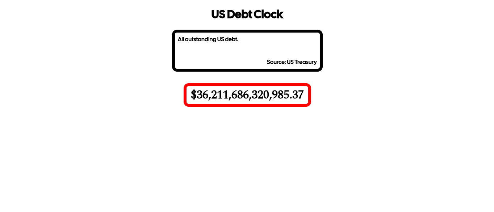

# US Debt Clock

An open-source project to visualize the current US debt using real, fact-based data. Created as an alternative to [usdebtclock.org](https://usdebtclock.org) and similar websites which provide inaccurate statistics.

## Features
- Real-time visualization of US debt changes
- Smooth animations displaying increases or decreases in debt
- Accurate data sourced from the FiscalData API

## Calculations
The visualization is calculated using these steps
1. Fetch the last 90 daily records of US debt data using the FiscalData API.
2. Calculate the daily change in debt for every data point and add it all together.
3. Compute the average daily rate of change by dividing the total change by 90 days.
4. Use the average daily rate of change to project the debt starting from one day after the last available data point.
5. Perform calculations 20 times per second to create smooth animations.

## Getting Started
Simply download everything in a folder and open index.html. Or host on your favorite static hosting site. No special software needed, just a web browser.

## Demo
View here: [usdebtclock.hamidmossa.me](usdebtclock.hamidmossa.me)

